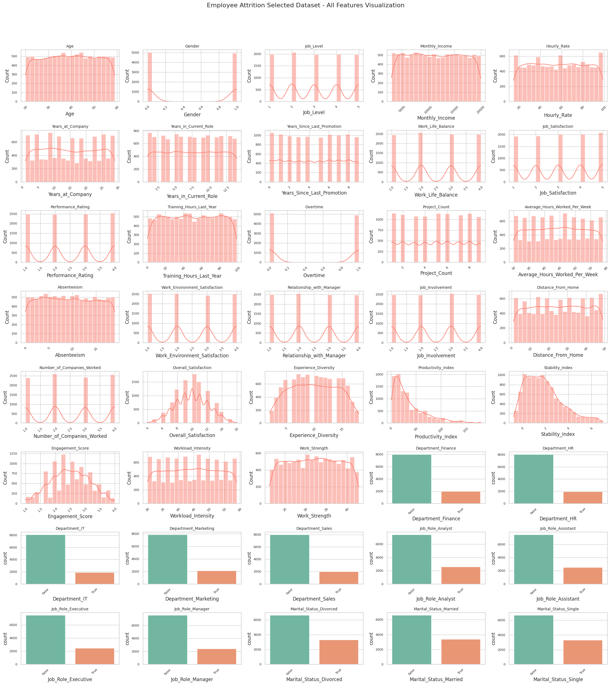
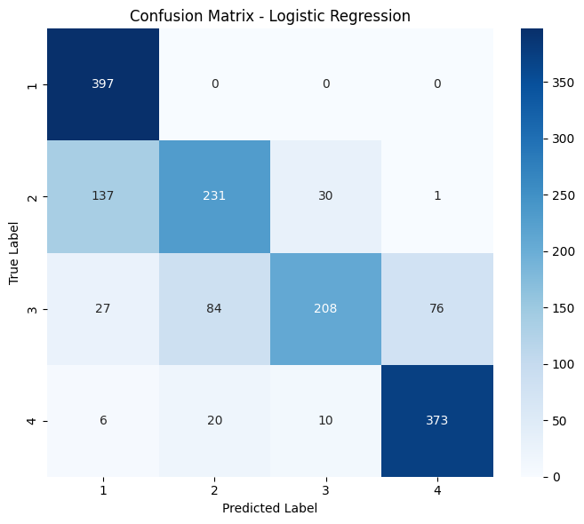
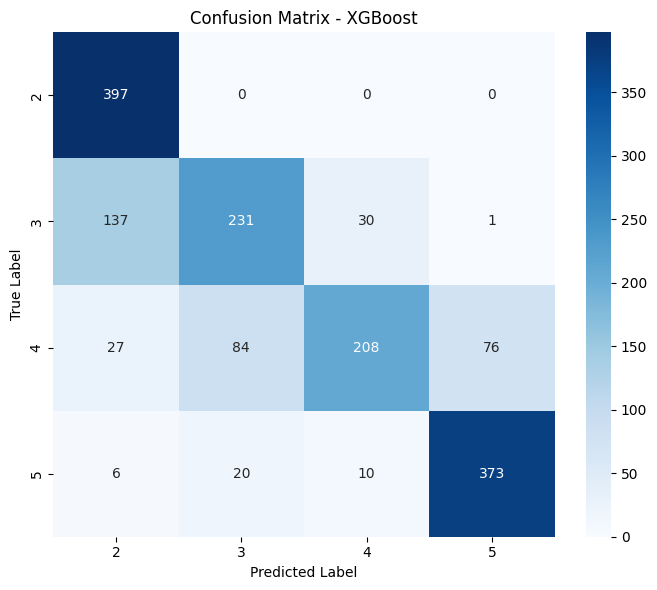
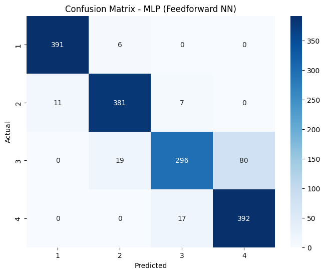
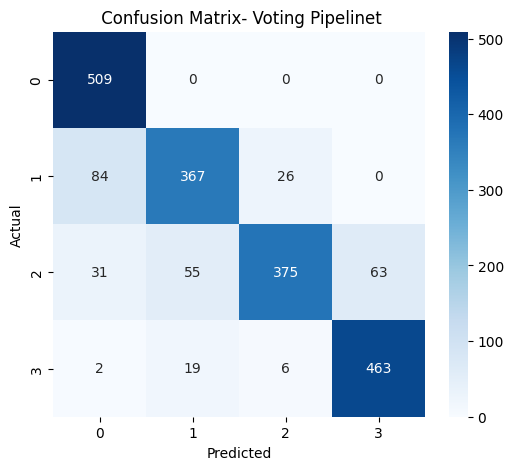

# Employee Performance Prediction for Attrition Analysis

##  Overview
Employee performance plays a critical role in organizational success and employee retention.  
This project applies machine learning techniques to predict employee performance and analyze its relationship with employee attrition using a Kaggle dataset of 10,000 records.

A complete data science pipeline was implemented, including data cleaning, feature engineering, class imbalance handling with SMOTE, and pipeline-based model training.

---

##  Dataset
- Source: Kaggle – Employee Attrition Prediction Dataset
- Records: 10,000 employees
- Original Features: 26
- Final Features (after engineering): 41
- Target Variable: Attrition (Yes / No)

---

##  Data Preprocessing
- Removed non-informative identifiers
- Label encoding for categorical features
- Feature engineering based on employee behavior and workload
- Correlation analysis to reduce redundancy
- Class imbalance handled using **SMOTE**
- Train–test split: 80% training, 20% testing

### 🔍 Preprocessed Dataset Snapshot

##  Models Implemented
- Logistic Regression
- Random Forest
- XGBoost
- Multi-Layer Perceptron (MLP – PyTorch)
- Voting Ensemble (LR + RF + XGBoost)

All models were trained using **scikit-learn pipelines** for reproducibility and consistency.

##  Model Performance

| Model | Test Accuracy | F1-Macro |
|------|--------------|---------|
| Logistic Regression | 24.8% | 0.2469 |
| Random Forest | 69.1% | 0.6693 |
| XGBoost | 80.0% | 0.7900 |
| MLP Neural Network | **93.0%** | **0.9297** |
| Voting Ensemble | 85.7% | 0.8534 |

## Confusion Matrices
 Logistic Regression  

---
Random Forest  

---
XGBoost  

---
 MLP Neural Network  

---
 Voting Ensemble  

##  Key Findings
- Neural networks outperform linear and tree-based models
- Employee performance strongly correlates with attrition risk
- Advanced feature engineering significantly boosts prediction accuracy
- Ensemble models provide stable and generalized performance

##  Future Work
- Temporal and longitudinal attrition analysis
- Fairness and bias evaluation
- Real-time deployment in HR systems

